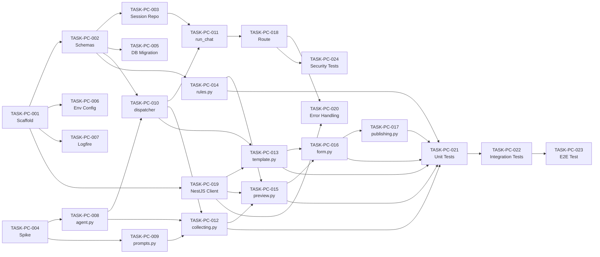

# PROGRAM-CONFIG Tasks

This tasks document breaks the PROGRAM-CONFIG TRD into implementation units that one engineer can pick up and execute independently. It covers the FastAPI backend (agent, state machine stages, NestJS client, session repository), the API route, and the integration and E2E tests. All tasks are sized for a single engineer in a 1-day sprint. Audience: the PTL (Madhuri Karedla) and any engineer working on the PROGRAM-CONFIG module.

> **Note**: TRD approval is blank (co-created with PRD in merged stage 40a+40c). Proceeding per PTL directive on small-project pipeline.

---

What can be parallel, what is gated, and who owns each piece?

<details><summary>Graph: What can be parallel, what is gated, and who owns each piece?</summary>

```items
---
id: tasks-cognition
title: PROGRAM-CONFIG Tasks cognition
default_open_depth: 1
default_color_by: kind
color_palette_source: .daksh/color-palette.json
width: 95vw
---

Schema Tasks:
  - task-01 :: TASK-PC-001 Scaffold directory | kind: Task | summary: Create packages/agents/program_config/ directory structure with all required stub files | spec: [§TASK-PC-001](tasks.md#task-pc-001)
  - task-02 :: TASK-PC-002 Schemas | kind: Task | summary: Define SessionState, CreateProgramDto, AgentOutput, ChatRequest, ChatResponse in schemas.py | spec: [§TASK-PC-002](tasks.md#task-pc-002)
  - task-03 :: TASK-PC-003 Session Repository | kind: Task | summary: Implement SessionRepository CRUD for agent_sessions table in repository.py | spec: [§TASK-PC-003](tasks.md#task-pc-003)
  - task-04 :: TASK-PC-004 PydanticAI spike | kind: Task | summary: Spike — validate PydanticAI structured output with a simple field extraction test | spec: [§TASK-PC-004](tasks.md#task-pc-004)

Infrastructure Tasks:
  - task-05 :: TASK-PC-005 DB migration | kind: Task | summary: Write SQL migration for agent_sessions table with indexes and soft-delete column | spec: [§TASK-PC-005](tasks.md#task-pc-005)
  - task-06 :: TASK-PC-006 Env config | kind: Task | summary: Configure env vars and settings for program config agent (NESTJS_BASE_URL, JWT_SECRET_KEY) | spec: [§TASK-PC-006](tasks.md#task-pc-006)
  - task-07 :: TASK-PC-007 Logfire setup | kind: Task | summary: Set up logfire spans for run_chat and all NestJS calls with session_id, user_id, stage fields | spec: [§TASK-PC-007](tasks.md#task-pc-007)

Agent Core:
  - task-08 :: TASK-PC-008 agent.py singleton | kind: Task | summary: Implement get_program_config_agent() singleton in agent.py | spec: [§TASK-PC-008](tasks.md#task-pc-008)
  - task-09 :: TASK-PC-009 prompts.py | kind: Task | summary: Write SYSTEM_PROMPT and EXTRACTION_PROMPT in prompts.py | spec: [§TASK-PC-009](tasks.md#task-pc-009)
  - task-10 :: TASK-PC-010 dispatcher | kind: Task | summary: Implement _dispatch() stage router in runners.py | spec: [§TASK-PC-010](tasks.md#task-pc-010)
  - task-11 :: TASK-PC-011 run_chat orchestrator | kind: Task | summary: Implement run_chat() (get session, dispatch, save, return response) | spec: [§TASK-PC-011](tasks.md#task-pc-011)

Collecting and Template Stage:
  - task-12 :: TASK-PC-012 collecting.py | kind: Task | summary: Implement collecting.py — field extraction, missing-field detection, clarifying question generation | spec: [§TASK-PC-012](tasks.md#task-pc-012)
  - task-13 :: TASK-PC-013 template.py | kind: Task | summary: Implement template.py — load program type templates from NestJS, present to admin | spec: [§TASK-PC-013](tasks.md#task-pc-013)
  - task-14 :: TASK-PC-014 rules.py | kind: Task | summary: Implement apply_rules() in rules.py — conditional field logic (isTravelInvolved, gst, etc.) | spec: [§TASK-PC-014](tasks.md#task-pc-014)

Preview Form and Publishing Stage:
  - task-15 :: TASK-PC-015 preview.py | kind: Task | summary: Implement preview.py — assemble and show CreateProgramDto preview, handle edit requests, call POST /program on confirm | spec: [§TASK-PC-015](tasks.md#task-pc-015)
  - task-16 :: TASK-PC-016 form.py | kind: Task | summary: Implement form.py — show template questions, handle add/remove/reorder, call POST /program-question on confirm | spec: [§TASK-PC-016](tasks.md#task-pc-016)
  - task-17 :: TASK-PC-017 publishing.py | kind: Task | summary: Implement publishing.py — run validate_for_publish(), call PUT /program/:id/status with uppercase accessType | spec: [§TASK-PC-017](tasks.md#task-pc-017)

API Layer:
  - task-18 :: TASK-PC-018 FastAPI route | kind: Task | summary: Implement POST /api/v1/program-config/chat FastAPI route | spec: [§TASK-PC-018](tasks.md#task-pc-018)
  - task-19 :: TASK-PC-019 NestJS client | kind: Task | summary: Implement NestJSClient in api_client.py with @with_retry decorator | spec: [§TASK-PC-019](tasks.md#task-pc-019)
  - task-20 :: TASK-PC-020 Error handling | kind: Task | summary: Wire error handling — AgentProcessingError, NestJS 4xx/5xx → mapped HTTPException | spec: [§TASK-PC-020](tasks.md#task-pc-020)

Test Tasks:
  - task-21 :: TASK-PC-021 Unit tests | kind: Task | summary: Write unit tests for all stage handlers — mock LLM + respx for NestJS | spec: [§TASK-PC-021](tasks.md#task-pc-021)
  - task-22 :: TASK-PC-022 Integration tests | kind: Task | summary: Write integration tests covering all 8 state transitions — real test DB, mocked NestJS via respx | spec: [§TASK-PC-022](tasks.md#task-pc-022)
  - task-23 :: TASK-PC-023 E2E test | kind: Task | summary: Write E2E happy path test (COLLECTING → PUBLISHED) against staging NestJS | spec: [§TASK-PC-023](tasks.md#task-pc-023)
  - task-24 :: TASK-PC-024 Security tests | kind: Task | summary: Security tests — JWT enforcement, session isolation (user A cannot read user B session) | spec: [§TASK-PC-024](tasks.md#task-pc-024)

Decisions:
  - dec-07 :: Stage handler per state-machine state | kind: Decision | summary: Each state machine stage is a separate Python module in stages/ rather than a monolithic dispatcher | alternatives: (1) Single large if/elif dispatcher; (2) Strategy pattern with dynamic loading | reversal_trigger: Stage handlers accumulate cross-state logic that makes the monolith cleaner | spec: [§Technology Choices](trd.md#technology-choices)
  - dec-10 :: Use respx for NestJS mocking in tests | kind: Decision | summary: Mock NestJS HTTP calls with respx (httpx-compatible mock) rather than building a full NestJS stub | alternatives: (1) Real NestJS test instance; (2) Custom stub server | reversal_trigger: respx cannot mock a specific callback behavior needed by a test | spec: [§Testing Strategy](trd.md#testing-strategy)
  - dec-11 :: Write E2E test against staging NestJS | kind: Decision | summary: E2E tests run against the real staging NestJS instance rather than a mock, to catch real API contract issues | alternatives: (1) Mock NestJS everywhere; (2) Contract tests only | reversal_trigger: Staging NestJS is too unstable for automated E2E | spec: [§Testing Strategy](trd.md#testing-strategy)

- milestone-01 :: PROGRAM-CONFIG shipped | kind: Milestone | due: end of sprint | definition_of_done: All user stories AC-PC-001 through AC-PC-009 pass in staging; at least one real admin pilot session completed successfully | summary: Admin can configure and publish any HDB, MSD, TAT, or custom program via chat, and seekers see pre-filled registration forms | spec: [§Acceptance Criteria](prd.md#acceptance-criteria)
- milestone-02 :: All stage handlers implemented and tested | kind: Milestone | due: end of sprint day | definition_of_done: All 8 state transitions covered by integration tests; E2E happy path passing on staging | summary: Every stage handler is implemented, unit-tested, and integrated into the run_chat() orchestrator | spec: [§Detailed Task List](tasks.md#detailed-task-list)
- user-03 :: Madhuri Karedla / PTL | kind: User | role: PTL | audience: delivery | status: validated | summary: Project Technical Lead accountable for agent implementation and NestJS integration | spec: [§User Types](client-context.md#user-types)

user-03 -> milestone-01 | relation: owns
user-03 -> milestone-02 | relation: owns
dec-07 -> milestone-02 | relation: governs
task-01 -> task-02 | relation: enables
task-02 -> task-03 | relation: enables
task-02 -> task-05 | relation: enables
task-04 -> task-08 | relation: enables
task-04 -> task-09 | relation: enables
task-08 -> task-10 | relation: enables
task-10 -> task-11 | relation: enables
task-11 -> task-18 | relation: enables
task-12 -> task-15 | relation: enables
task-15 -> task-16 | relation: enables
task-16 -> task-17 | relation: enables
task-17 -> milestone-02 | relation: serves
task-21 -> task-22 | relation: enables
task-22 -> task-23 | relation: enables
task-22 -> milestone-02 | relation: serves
task-22 -> milestone-01 | relation: serves
```

</details>

---

## Dependency Diagram



## Parallel Work Plan

**Day 1 — start in parallel (no dependencies between them):**
- TASK-PC-001 (scaffold) — unblocks everything else; do this first
- TASK-PC-004 (PydanticAI spike) — can run alongside PC-001 in a scratch file
- TASK-PC-006 (env config) — independent of code structure

**After PC-001 completes — can all start in parallel:**
- TASK-PC-002 (schemas)
- TASK-PC-019 (NestJS client — only needs the directory to exist)
- TASK-PC-007 (logfire — only needs the directory to exist)

**After PC-002 + PC-004 complete:**
- TASK-PC-003 (session repo), TASK-PC-005 (DB migration), TASK-PC-008 (agent.py), TASK-PC-009 (prompts.py), TASK-PC-014 (rules.py)

**After PC-008 + PC-002:**
- TASK-PC-010 (dispatcher), then PC-011 (run_chat), then PC-018 (route)

**Stage handlers are sequential by design:**
PC-012 → PC-015 → PC-016 → PC-017. PC-013 is parallel to PC-012 (both need PC-010 + PC-019).

**Test track starts after all stage handlers:**
PC-021 (unit) → PC-022 (integration) → PC-023 (E2E). PC-024 (security) starts after PC-018.

---

## Detailed Task List

---

#### TASK-PC-001: Scaffold packages/agents/program_config/ directory structure

- **Type**: Task
- **Parent**: —
- **Epic**: Program Configuration Agent
- **Sprint**: Sprint 1
- **Points**: 1
- **Assignee**: Junior — backend
- **Traces to**: [US-PC-001](prd.md#user-stories) (foundational — enables all user stories)
- **Depends on**: none
- **Description**: Create the `packages/agents/program_config/` directory with all required stub files: `agent.py`, `schemas.py`, `prompts.py`, `rules.py`, `templates.py`, `db_lookup.py`, `repository.py`, `api_client.py`, `runners.py`, and the `stages/` subdirectory with `__init__.py` files and stubs for `collecting.py`, `template.py`, `preview.py`, `form.py`, and `publishing.py`. Each stub should have a module docstring and a `TODO` comment at the function level so the directory is importable from day 1.
- **Decision budget**:
  - Junior can decide: file naming within the module; stub content (docstring wording)
  - Escalate to TL/PTL: any change to the top-level directory structure or naming conventions
- **Acceptance criteria**:
  - [ ] `packages/agents/program_config/` directory exists with all required files
  - [ ] `stages/` subdirectory exists with stubs for all 5 stage handler files
  - [ ] All stub files are importable (`python -c "import packages.agents.program_config"` succeeds)
  - [ ] No circular imports
- **Definition of Done**:
  - [ ] Jira ticket updated to Done
  - [ ] Tests passing per testing strategy in TRD
  - [ ] PR reviewed and merged to module branch
  - [ ] Relevant doc section updated if behavior changed

---

#### TASK-PC-002: Define schemas in schemas.py

- **Type**: Task
- **Parent**: TASK-PC-001
- **Epic**: Program Configuration Agent
- **Sprint**: Sprint 1
- **Points**: 3
- **Assignee**: Senior — backend
- **Traces to**: [US-PC-001](prd.md#user-stories), [US-PC-002](prd.md#user-stories)
- **Depends on**: TASK-PC-001
- **Description**: Define all Pydantic models for the program config agent in `schemas.py`: `ProgramConfigStage` (enum), `CreateProgramDto` (all 30+ fields with appropriate defaults and validators), `SessionState`, `AgentOutput`, `MessageHistoryItem`, `QuestionDto`, `ChatRequest`, and `ChatResponse`. Follow the strict typing rules in `CLAUDE.md`: no `dict[str, Any]` in public signatures; enums for all discriminated values; all optional fields default to `None` or a factory. The `CreateProgramDto` field list must match the NestJS `CreateProgramDto` exactly — verify against the NestJS source or API documentation before finalizing.
- **Decision budget**:
  - Junior can decide: field ordering within a model; docstring wording
  - Escalate to TL/PTL: any field name that differs from the NestJS DTO; adding or removing required fields; any `dict[str, Any]` usage
- **Acceptance criteria**:
  - [ ] All 8 model classes defined and importable
  - [ ] `ProgramConfigStage` enum covers all 8 stages
  - [ ] `CreateProgramDto` fields match NestJS DTO (verified by inspection)
  - [ ] No `dict[str, Any]` in any public field or function signature
  - [ ] `AgentOutput` has all 5 fields from the TRD schema
  - [ ] Unit tests for model validation pass (required fields raise `ValidationError` when missing)
- **Definition of Done**:
  - [ ] Jira ticket updated to Done
  - [ ] Tests passing per testing strategy in TRD
  - [ ] PR reviewed and merged to module branch
  - [ ] Relevant doc section updated if behavior changed

---

#### TASK-PC-003: Implement SessionRepository in repository.py

- **Type**: Task
- **Parent**: TASK-PC-001
- **Epic**: Program Configuration Agent
- **Sprint**: Sprint 1
- **Points**: 3
- **Assignee**: Mid — backend
- **Traces to**: [US-PC-009](prd.md#user-stories) (session memory)
- **Depends on**: TASK-PC-001, TASK-PC-002
- **Description**: Implement `SessionRepository` in `packages/agents/program_config/repository.py` with three async methods: `get_or_create(session_id, user_id) -> SessionState`, `get(session_id, user_id) -> SessionState | None`, and `save(session_id, user_id, state) -> None`. Use SQLAlchemy async engine (`SessionLocal` context manager from `packages/db/database.py`). Map ORM rows to `SessionState` domain models before returning — never leak SQLAlchemy row objects. Include soft-delete filtering: all queries add `WHERE deleted_at IS NULL`.
- **Decision budget**:
  - Junior can decide: SQL query formatting; logging field names
  - Escalate to TL/PTL: any change to the `agent_sessions` table schema; any async session management pattern that deviates from `CLAUDE.md`
- **Acceptance criteria**:
  - [ ] `get_or_create()` creates a new row on first call and returns existing row on subsequent calls with the same `session_id`
  - [ ] `save()` updates `state_data`, `stage`, `program_id`, and `updated_at`
  - [ ] `get()` returns `None` for unknown `session_id` (no exception)
  - [ ] All queries include `WHERE user_id = :uid` for session isolation
  - [ ] Soft-deleted sessions (`deleted_at IS NOT NULL`) are excluded from all queries
  - [ ] Integration tests pass against real test database
- **Definition of Done**:
  - [ ] Jira ticket updated to Done
  - [ ] Tests passing per testing strategy in TRD
  - [ ] PR reviewed and merged to module branch
  - [ ] Relevant doc section updated if behavior changed

---

#### TASK-PC-004: Spike — validate PydanticAI structured output

- **Type**: Spike
- **Parent**: —
- **Epic**: Program Configuration Agent
- **Sprint**: Sprint 1
- **Points**: 2
- **Assignee**: Senior — backend
- **Traces to**: [§Technology Choices](trd.md#technology-choices) (dec-05)
- **Depends on**: none
- **Description**: Write a standalone Python script (not part of the main codebase) that initializes a `pydantic_ai.Agent` with `output_type=AgentOutput` and runs a simple field extraction prompt (e.g., "Extract the program type and duration from: '5-day HDB, online, June 15'"). Verify that the agent returns a validated `AgentOutput` instance, not a raw string. Record the output schema, any validation errors encountered, and the model response format. This spike directly validates dec-05 before building the full agent. If PydanticAI fails to return a structured output, escalate to PTL before proceeding with TASK-PC-008.
- **Decision budget**:
  - Junior can decide: choice of test prompt; model to use in the spike (Gemini or Groq)
  - Escalate to TL/PTL: if structured output validation fails for more than 2 out of 5 test prompts; if PydanticAI raises `UnexpectedModelBehavior` consistently
- **Acceptance criteria**:
  - [ ] Spike script runs end-to-end without errors
  - [ ] `AgentOutput` Pydantic model is returned and validated (not raw string or dict)
  - [ ] At least 4 of 5 test prompts return correctly structured output
  - [ ] Spike findings documented in a comment at the top of `agent.py`
- **Definition of Done**:
  - [ ] Jira ticket updated to Done
  - [ ] Tests passing per testing strategy in TRD
  - [ ] PR reviewed and merged to module branch
  - [ ] Relevant doc section updated if behavior changed

---

#### TASK-PC-005: Write DB migration for agent_sessions table

- **Type**: Task
- **Parent**: TASK-PC-002
- **Epic**: Program Configuration Agent
- **Sprint**: Sprint 1
- **Points**: 2
- **Assignee**: Junior — backend
- **Traces to**: [§Data Model](trd.md#data-model)
- **Depends on**: TASK-PC-002
- **Description**: Write the SQL migration for the `agent_sessions` table as defined in the TRD Data Model section. Include all columns (`id`, `session_id`, `user_id`, `stage`, `state_data`, `program_id`, `created_at`, `updated_at`, `deleted_at`), the UNIQUE constraint on `session_id`, and both indexes (`idx_agent_sessions_session_id`, `idx_agent_sessions_user_id`). Follow the project's migration conventions (raw SQL files or Alembic — check existing migrations in the project for the pattern). Never use `Base.metadata.create_all` in production.
- **Decision budget**:
  - Junior can decide: migration file naming (follow existing convention)
  - Escalate to TL/PTL: any schema change from what the TRD specifies; migration tool choice if not established in the project
- **Acceptance criteria**:
  - [ ] Migration runs cleanly on a fresh test database
  - [ ] `agent_sessions` table created with all columns and constraints
  - [ ] Both indexes created and visible via `\d agent_sessions` or equivalent
  - [ ] Migration is idempotent (running it twice does not error)
- **Definition of Done**:
  - [ ] Jira ticket updated to Done
  - [ ] Tests passing per testing strategy in TRD
  - [ ] PR reviewed and merged to module branch
  - [ ] Relevant doc section updated if behavior changed

---

#### TASK-PC-006: Configure env vars and settings for program config agent

- **Type**: Task
- **Parent**: TASK-PC-001
- **Epic**: Program Configuration Agent
- **Sprint**: Sprint 1
- **Points**: 1
- **Assignee**: Junior — backend
- **Traces to**: [§Deployment and Operations](trd.md#deployment-and-operations)
- **Depends on**: TASK-PC-001
- **Description**: Add `NESTJS_BASE_URL` and any program-config-specific settings to `packages/config/settings.py` as `BaseSettings` fields. Add corresponding entries to `.env.example`. `NESTJS_BASE_URL` should use `SecretStr` if it contains credentials, or `str` if it is a plain URL. Verify that `get_settings()` (with `@lru_cache`) picks up the new fields correctly. Do not hardcode any URLs or credentials anywhere in the module code.
- **Decision budget**:
  - Junior can decide: field name casing in `.env.example` (follow existing convention)
  - Escalate to TL/PTL: if `NESTJS_BASE_URL` already exists in settings under a different name
- **Acceptance criteria**:
  - [ ] `NESTJS_BASE_URL` available via `get_settings().nestjs_base_url`
  - [ ] `.env.example` updated with all new variables and comments explaining each
  - [ ] `get_settings()` works correctly in test environment with a `TEST_NESTJS_BASE_URL` override
  - [ ] No hardcoded URLs or credentials in any module file
- **Definition of Done**:
  - [ ] Jira ticket updated to Done
  - [ ] Tests passing per testing strategy in TRD
  - [ ] PR reviewed and merged to module branch
  - [ ] Relevant doc section updated if behavior changed

---

#### TASK-PC-007: Set up logfire spans for run_chat and all NestJS calls

- **Type**: Task
- **Parent**: TASK-PC-001
- **Epic**: Program Configuration Agent
- **Sprint**: Sprint 1
- **Points**: 2
- **Assignee**: Mid — backend
- **Traces to**: [§Security](trd.md#security), [§NFR Design](trd.md#nfr-design)
- **Depends on**: TASK-PC-001
- **Description**: Define the logfire span structure for the program config agent. The span hierarchy is: `program_config.chat` (wraps the entire `run_chat()` call) → `nestjs.<method>.<endpoint>` (wraps each NestJS call) → `session.save` (wraps each repository save). All spans must include `session_id`, `user_id`, and `stage` as structured fields. Apply the `@log_agent_run("program_config")` decorator from `packages/logging/decorators.py` to `run_chat()`. This task delivers the span skeleton — actual span calls will be wired when implementing PC-008 through PC-020.
- **Decision budget**:
  - Junior can decide: span name formatting (follow the pattern `domain.operation`)
  - Escalate to TL/PTL: any logfire configuration that requires a new logfire project or token
- **Acceptance criteria**:
  - [ ] `@log_agent_run("program_config")` applied to `run_chat()` in runners.py stub
  - [ ] Span names and field names documented in a docstring comment in `runners.py`
  - [ ] Logfire span hierarchy matches the TRD specification (`program_config.chat` → `nestjs.*` → `session.save`)
  - [ ] No `print()` or `logging.*` calls anywhere in the module
- **Definition of Done**:
  - [ ] Jira ticket updated to Done
  - [ ] Tests passing per testing strategy in TRD
  - [ ] PR reviewed and merged to module branch
  - [ ] Relevant doc section updated if behavior changed

---

#### TASK-PC-008: Implement get_program_config_agent() singleton in agent.py

- **Type**: Task
- **Parent**: TASK-PC-004
- **Epic**: Program Configuration Agent
- **Sprint**: Sprint 1
- **Points**: 2
- **Assignee**: Senior — backend
- **Traces to**: [US-PC-001](prd.md#user-stories), [§Technology Choices](trd.md#technology-choices) (dec-05)
- **Depends on**: TASK-PC-004
- **Description**: Implement `get_program_config_agent()` in `packages/agents/program_config/agent.py` using the singleton factory pattern defined in `CLAUDE.md`. The agent must be typed `Agent[None, AgentOutput]`. Use `get_model()` from `packages/config/model_factory.py` for the model. The system prompt is imported from `prompts.py`. The singleton is a module-level `_agent: Agent[None, AgentOutput] | None = None` variable; `get_program_config_agent()` initializes it on first call and returns it on subsequent calls. Do not recreate the agent per request.
- **Decision budget**:
  - Junior can decide: internal variable naming within the file
  - Escalate to TL/PTL: any deviation from `Agent[None, AgentOutput]` typing; any additional PydanticAI configuration not in the TRD
- **Acceptance criteria**:
  - [ ] `get_program_config_agent()` returns the same instance on repeated calls (singleton test)
  - [ ] Agent is typed `Agent[None, AgentOutput]`
  - [ ] `output_type=AgentOutput` is passed at initialization (never untyped)
  - [ ] Agent uses `get_model()` — no hardcoded model string
  - [ ] Unit test: calling `get_program_config_agent()` twice returns `is` the same object
- **Definition of Done**:
  - [ ] Jira ticket updated to Done
  - [ ] Tests passing per testing strategy in TRD
  - [ ] PR reviewed and merged to module branch
  - [ ] Relevant doc section updated if behavior changed

---

#### TASK-PC-009: Write SYSTEM_PROMPT and EXTRACTION_PROMPT in prompts.py

- **Type**: Task
- **Parent**: TASK-PC-004
- **Epic**: Program Configuration Agent
- **Sprint**: Sprint 1
- **Points**: 3
- **Assignee**: Senior — backend
- **Traces to**: [US-PC-001](prd.md#user-stories), [US-PC-006](prd.md#user-stories)
- **Depends on**: TASK-PC-004
- **Description**: Write `SYSTEM_PROMPT` and `EXTRACTION_PROMPT` as module-level string constants in `prompts.py`. `SYSTEM_PROMPT` must instruct the LLM to: (1) extract program fields from natural language; (2) ask for missing fields one group at a time (not all at once); (3) never re-ask for fields already confirmed; (4) apply conditional logic (only ask for `onlineType` if mode is ONLINE/HYBRID, etc.); (5) output in the `AgentOutput` JSON schema. `EXTRACTION_PROMPT` is a template with `{fields_needed}` and `{conversation_history}` placeholders for the collecting stage. Both prompts must be tested against at least 3 real admin message examples before merging.
- **Decision budget**:
  - Junior can decide: phrasing and tone of clarifying questions in the prompt
  - Escalate to TL/PTL: any change to the field grouping logic or conditional field rules; if test prompts fail to extract required fields in 3+ examples
- **Acceptance criteria**:
  - [ ] `SYSTEM_PROMPT` and `EXTRACTION_PROMPT` defined as module-level `str` constants
  - [ ] Prompt instructs LLM to output in `AgentOutput` JSON schema
  - [ ] At least 3 manual test runs documented in a comment showing correct extraction
  - [ ] Conditional field rules (BR-PC-007) are reflected in the prompt
  - [ ] BR-PC-006 (never re-ask confirmed fields) is explicitly instructed in the prompt
- **Definition of Done**:
  - [ ] Jira ticket updated to Done
  - [ ] Tests passing per testing strategy in TRD
  - [ ] PR reviewed and merged to module branch
  - [ ] Relevant doc section updated if behavior changed

---

#### TASK-PC-010: Implement _dispatch() stage router in runners.py

- **Type**: Task
- **Parent**: TASK-PC-008
- **Epic**: Program Configuration Agent
- **Sprint**: Sprint 1
- **Points**: 3
- **Assignee**: Mid — backend
- **Traces to**: [§Architecture Overview](trd.md#architecture-overview), [§State Machines](trd.md#state-machines)
- **Depends on**: TASK-PC-002, TASK-PC-008
- **Description**: Implement `_dispatch(state: SessionState, message: str, agent: Agent) -> tuple[SessionState, str]` in `runners.py`. Use a `match session.stage:` block (Python 3.10+ structural pattern matching) to route to the appropriate stage handler. Import stage handlers lazily within the match arms to avoid circular imports. Return `(updated_state, reply_text)` from each arm. Include a fallback `case _:` arm that logs a warning and returns the current state with an error message.
- **Decision budget**:
  - Junior can decide: whether to import stage handlers at module level or inside match arms (lazy import preferred to avoid circular deps)
  - Escalate to TL/PTL: any stage routing logic that deviates from the TRD state machine; adding states not in the TRD
- **Acceptance criteria**:
  - [ ] `_dispatch()` routes to the correct stage handler for all 8 `ProgramConfigStage` values
  - [ ] Fallback `case _:` arm handles unknown stages without raising an exception
  - [ ] Unit tests: one test per stage verifying correct handler is called
  - [ ] No circular imports
- **Definition of Done**:
  - [ ] Jira ticket updated to Done
  - [ ] Tests passing per testing strategy in TRD
  - [ ] PR reviewed and merged to module branch
  - [ ] Relevant doc section updated if behavior changed

---

#### TASK-PC-011: Implement run_chat() orchestrator in runners.py

- **Type**: Task
- **Parent**: TASK-PC-010
- **Epic**: Program Configuration Agent
- **Sprint**: Sprint 1
- **Points**: 3
- **Assignee**: Mid — backend
- **Traces to**: [US-PC-001](prd.md#user-stories), [US-PC-009](prd.md#user-stories)
- **Depends on**: TASK-PC-003, TASK-PC-010
- **Description**: Implement the full `run_chat(request: ChatRequest) -> ChatResponse` orchestrator in `runners.py`. The sequence is: (1) load or create `SessionState` via `SessionRepository`; (2) append the incoming message to `message_history`; (3) call `_dispatch()`; (4) call `session_repository.save()` — this must happen **before** assembling the response (invariant-01); (5) assemble and return `ChatResponse`. Wrap the entire function body in `logfire.span("program_config.chat")`. Handle `ModelHTTPError`, `UnexpectedModelBehavior`, and `httpx.ConnectError` explicitly — map them to `AgentProcessingError` (never raise `HTTPException` from a runner).
- **Decision budget**:
  - Junior can decide: exact error message text surfaced to the admin
  - Escalate to TL/PTL: any change to the save-before-respond invariant; any exception that is swallowed rather than mapped
- **Acceptance criteria**:
  - [ ] `session_repository.save()` is called before `ChatResponse` is assembled
  - [ ] `ModelHTTPError`, `UnexpectedModelBehavior`, and `httpx.ConnectError` each have explicit `except` arms
  - [ ] `ChatResponse` correctly populates `stage`, `requires_confirmation`, and `preview_data` from the updated state
  - [ ] Integration test: full round-trip from `ChatRequest` to persisted `SessionState`
- **Definition of Done**:
  - [ ] Jira ticket updated to Done
  - [ ] Tests passing per testing strategy in TRD
  - [ ] PR reviewed and merged to module branch
  - [ ] Relevant doc section updated if behavior changed

---

#### TASK-PC-012: Implement stages/collecting.py — field extraction stage

- **Type**: Story
- **Parent**: TASK-PC-010
- **Epic**: Program Configuration Agent
- **Sprint**: Sprint 1
- **Points**: 5
- **Assignee**: Senior — backend
- **Traces to**: [US-PC-001](prd.md#user-stories), [US-PC-009](prd.md#user-stories), [AC-PC-001](prd.md#acceptance-criteria)
- **Depends on**: TASK-PC-008, TASK-PC-009, TASK-PC-010
- **Description**: Implement `handle(state: SessionState, message: str, agent: Agent) -> tuple[SessionState, str]` in `stages/collecting.py`. This handler: (1) calls `agent.run(EXTRACTION_PROMPT.format(...), message_history=state.message_history)` to extract fields from the admin's message; (2) merges extracted fields into `state.program_config` (never overwriting fields already confirmed); (3) calls `apply_rules(state)` to enforce BR-PC-002 and BR-PC-003; (4) checks which required fields are still missing; (5) if all required fields are present, transitions `state.stage` to `TEMPLATE_SELECTION`; (6) otherwise generates a clarifying question for the next group of missing fields and returns without transitioning. The handler must never re-ask for fields already set in `program_config` (BR-PC-006).
- **Decision budget**:
  - Junior can decide: clarifying question phrasing and grouping strategy
  - Escalate to TL/PTL: any change to the required field list (must match BR-PC-010); any override of an already-confirmed field
- **Acceptance criteria**:
  - [ ] AC-PC-001 passes: given "HDB 5 days online June 15 100 seats", extracts type/mode/dates/seats and asks only for missing fields
  - [ ] AC-PC-009 passes: field confirmed in message 3 is not re-asked in message 8
  - [ ] BR-PC-002 enforced: `isTravelInvolved = False` when `modeOfOperation = ONLINE`
  - [ ] Stage transitions to `TEMPLATE_SELECTION` when all required fields are present
  - [ ] Unit tests with mocked `AgentOutput` covering: full extraction, partial extraction, and no extraction cases
- **Definition of Done**:
  - [ ] Jira ticket updated to Done
  - [ ] Tests passing per testing strategy in TRD
  - [ ] PR reviewed and merged to module branch
  - [ ] Relevant doc section updated if behavior changed

---

#### TASK-PC-013: Implement stages/template.py — template selection stage

- **Type**: Story
- **Parent**: TASK-PC-010
- **Epic**: Program Configuration Agent
- **Sprint**: Sprint 1
- **Points**: 3
- **Assignee**: Mid — backend
- **Traces to**: [US-PC-004](prd.md#user-stories), [AC-PC-004](prd.md#acceptance-criteria)
- **Depends on**: TASK-PC-010, TASK-PC-019
- **Description**: Implement `handle(state: SessionState, message: str) -> tuple[SessionState, str]` in `stages/template.py`. This handler: (1) calls `GET /v1/program-templates/program-type/:typeId` via `NestJSClient`; (2) presents available templates to the admin in a numbered list; (3) on admin confirmation (message contains a template number or name), sets `state.template_id` and transitions to `PROGRAM_PREVIEW`; (4) handles the case where no templates are returned — surface a clear message and block the transition (this is oq-07). Wrap the NestJS call in `logfire.span("nestjs.get.program_templates")`.
- **Decision budget**:
  - Junior can decide: template list formatting in the reply text
  - Escalate to TL/PTL: behavior when no templates exist (per oq-07 — escalate for a decision before merging)
- **Acceptance criteria**:
  - [ ] AC-PC-004 passes: agent calls `GET /v1/program-templates/program-type/:typeId` and presents options grouped by section
  - [ ] Template confirmation sets `state.template_id` and advances to `PROGRAM_PREVIEW`
  - [ ] Empty template list is handled gracefully (no exception; admin sees a clear message)
  - [ ] Unit tests: successful template list, empty template list, admin confirms template
- **Definition of Done**:
  - [ ] Jira ticket updated to Done
  - [ ] Tests passing per testing strategy in TRD
  - [ ] PR reviewed and merged to module branch
  - [ ] Relevant doc section updated if behavior changed

---

#### TASK-PC-014: Implement apply_rules() in rules.py

- **Type**: Task
- **Parent**: TASK-PC-002
- **Epic**: Program Configuration Agent
- **Sprint**: Sprint 1
- **Points**: 3
- **Assignee**: Mid — backend
- **Traces to**: [US-PC-006](prd.md#user-stories), [§Business Rules](prd.md#business-rules)
- **Depends on**: TASK-PC-002
- **Description**: Implement `apply_rules(state: SessionState) -> SessionState` and `validate_for_publish(state: SessionState) -> list[str]` in `rules.py`. `apply_rules()` enforces: BR-PC-002 (`isTravelInvolved = False` when ONLINE); BR-PC-003 (`gstPercentage = cgst + sgst`, never asked directly); BR-PC-007 (clear conditional fields that are now irrelevant given the current mode). `validate_for_publish()` returns a list of validation error messages; an empty list means the program is ready to publish. Validation checks: all required fields non-null, program code unique (this check requires a NestJS call — pass in a `code_checker` callable parameter to keep `rules.py` free of HTTP dependencies), form attached with at least 1 question (BR-PC-008).
- **Decision budget**:
  - Junior can decide: error message phrasing in `validate_for_publish()`
  - Escalate to TL/PTL: any business rule not in the TRD; any case where an admin should be able to override a forced value
- **Acceptance criteria**:
  - [ ] `apply_rules()` sets `isTravelInvolved = False` when `modeOfOperation = ONLINE`
  - [ ] `apply_rules()` computes `gstPercentage = cgst + sgst`
  - [ ] `validate_for_publish()` returns non-empty list when form has 0 questions
  - [ ] `validate_for_publish()` returns empty list when all checks pass
  - [ ] Unit tests for each business rule in isolation
- **Definition of Done**:
  - [ ] Jira ticket updated to Done
  - [ ] Tests passing per testing strategy in TRD
  - [ ] PR reviewed and merged to module branch
  - [ ] Relevant doc section updated if behavior changed

---

#### TASK-PC-015: Implement stages/preview.py — program preview and creation

- **Type**: Story
- **Parent**: TASK-PC-012
- **Epic**: Program Configuration Agent
- **Sprint**: Sprint 1
- **Points**: 5
- **Assignee**: Senior — backend
- **Traces to**: [US-PC-002](prd.md#user-stories), [US-PC-003](prd.md#user-stories), [AC-PC-002](prd.md#acceptance-criteria), [AC-PC-003](prd.md#acceptance-criteria)
- **Depends on**: TASK-PC-012, TASK-PC-014, TASK-PC-019
- **Description**: Implement `handle(state: SessionState, message: str) -> tuple[SessionState, str]` in `stages/preview.py`. The handler has two sub-modes based on message content: (1) **show preview**: assemble `preview_data` dict from `state.program_config`, call `GET /program/check-code` to validate code uniqueness, set `requires_confirmation=True` in the reply, and return without advancing stage; (2) **confirm ("yes")**: call `POST /program` with the `CreateProgramDto` payload, set `state.program_id`, advance stage to `PROGRAM_CREATED` and immediately to `FORM_PREVIEW`; (3) **edit ("change X to Y")**: parse the edit request (may use a small LLM call or regex), update only the specified field in `state.program_config`, re-validate, and re-show the preview (AC-PC-003). Guard: check `state.program_id is None` before calling `POST /program` to prevent duplicates (risk-05).
- **Decision budget**:
  - Junior can decide: preview table formatting (Markdown table recommended)
  - Escalate to TL/PTL: any edit request that requires re-asking the user for a value (re-ask in the same message rather than a new turn)
- **Acceptance criteria**:
  - [ ] AC-PC-002 passes: tabular preview rendered before any write API is called
  - [ ] AC-PC-003 passes: editing one field re-shows full preview with only that field changed
  - [ ] `POST /program` is called exactly once per session (duplicate guard via `program_id is None` check)
  - [ ] Stage advances to `FORM_PREVIEW` after successful `POST /program`
  - [ ] Unit tests: show preview, confirm preview (POST /program mocked), edit field, NestJS 400 response
- **Definition of Done**:
  - [ ] Jira ticket updated to Done
  - [ ] Tests passing per testing strategy in TRD
  - [ ] PR reviewed and merged to module branch
  - [ ] Relevant doc section updated if behavior changed

---

#### TASK-PC-016: Implement stages/form.py — form preview and attachment

- **Type**: Story
- **Parent**: TASK-PC-015
- **Epic**: Program Configuration Agent
- **Sprint**: Sprint 1
- **Points**: 5
- **Assignee**: Senior — backend
- **Traces to**: [US-PC-004](prd.md#user-stories), [US-PC-005](prd.md#user-stories), [AC-PC-005](prd.md#acceptance-criteria)
- **Depends on**: TASK-PC-013, TASK-PC-015
- **Description**: Implement `handle(state: SessionState, message: str) -> tuple[SessionState, str]` in `stages/form.py`. On entry from `FORM_PREVIEW` state: (1) load `state.pending_questions` from the template (already set during `template.py` stage); (2) show questions grouped by `FormSection` with `displayOrder` preserved (BR-PC-009); (3) on admin add/remove/reorder request, update `state.pending_questions` and re-show (FORM_PREVIEW→FORM_PREVIEW self-transition); (4) on admin confirmation, call `POST /program-question` with the full `pending_questions` list, set `state.form_attached=True`, `state.question_count=len(pending_questions)`, advance stage to `FORM_ATTACHED`. Handle the case where `pending_questions` is empty before the confirm call — this is blocked by validation (BR-PC-008) but should surface a clear message.
- **Decision budget**:
  - Junior can decide: section separator formatting in the reply text
  - Escalate to TL/PTL: any question reordering logic that changes section membership (BR-PC-009 forbids this)
- **Acceptance criteria**:
  - [ ] AC-PC-005 passes: removing a question re-shows the updated list before calling POST /program-question
  - [ ] BR-PC-009 enforced: section order and `displayOrder` preserved from template
  - [ ] `POST /program-question` not called if `pending_questions` is empty
  - [ ] `state.form_attached=True` and `state.question_count >= 1` after successful attachment
  - [ ] Unit tests: show form preview, add question, remove question, confirm form, empty form blocked
- **Definition of Done**:
  - [ ] Jira ticket updated to Done
  - [ ] Tests passing per testing strategy in TRD
  - [ ] PR reviewed and merged to module branch
  - [ ] Relevant doc section updated if behavior changed

---

#### TASK-PC-017: Implement stages/publishing.py — validation and publish

- **Type**: Story
- **Parent**: TASK-PC-016
- **Epic**: Program Configuration Agent
- **Sprint**: Sprint 1
- **Points**: 3
- **Assignee**: Mid — backend
- **Traces to**: [US-PC-006](prd.md#user-stories), [US-PC-007](prd.md#user-stories), [AC-PC-006](prd.md#acceptance-criteria), [AC-PC-007](prd.md#acceptance-criteria)
- **Depends on**: TASK-PC-016
- **Description**: Implement `handle(state: SessionState, message: str) -> tuple[SessionState, str]` in `stages/publishing.py`. When admin says "publish": (1) call `validate_for_publish(state)` from `rules.py`; (2) if validation errors exist, block publish and show the error list (AC-PC-006); (3) if validation passes, set `requires_confirmation=True` and show a final confirmation summary; (4) on admin final confirmation, call `PUT /program/:id/status` with `{"status":"PUBLISHED","updatedBy":state.user_id,"accessType":state.program_config.access_type.upper()}` — the `.upper()` call is mandatory (invariant-02 / BR-PC-005); (5) advance stage to `PUBLISHED`. Guard: check `state.stage != PUBLISHED` before calling PUT to prevent double-publish.
- **Decision budget**:
  - Junior can decide: confirmation summary formatting
  - Escalate to TL/PTL: if `.upper()` is already enforced elsewhere and might cause double-coercion; any validation rule added or removed
- **Acceptance criteria**:
  - [ ] AC-PC-006 passes: "publish" with 0 questions returns a blocking error, not a 400 from NestJS
  - [ ] AC-PC-007 passes: `accessType` in PUT payload is uppercase (PUBLIC/INTERNAL/RESTRICTED)
  - [ ] Stage advances to `PUBLISHED` only after NestJS PUT call succeeds
  - [ ] Double-publish guard: if stage is already `PUBLISHED`, return early without calling NestJS
  - [ ] Unit tests: validation failure blocks publish; successful publish with uppercase accessType; NestJS 4xx handled
- **Definition of Done**:
  - [ ] Jira ticket updated to Done
  - [ ] Tests passing per testing strategy in TRD
  - [ ] PR reviewed and merged to module branch
  - [ ] Relevant doc section updated if behavior changed

---

#### TASK-PC-018: Implement POST /api/v1/program-config/chat FastAPI route

- **Type**: Task
- **Parent**: TASK-PC-011
- **Epic**: Program Configuration Agent
- **Sprint**: Sprint 1
- **Points**: 2
- **Assignee**: Mid — backend
- **Traces to**: [§API Contracts](trd.md#api-contracts)
- **Depends on**: TASK-PC-011
- **Description**: Implement `POST /api/v1/program-config/chat` in `apps/api/routes/v1/routers/program_config.py`. Route signature: `async def chat(request: ChatRequest) -> APIResponse[ChatResponse]`. The route only: validates the JWT (via middleware — route does not validate tokens directly); calls `run_chat(request)`; returns `success_response(data)`. No business logic in the route. Map `AgentProcessingError` → HTTP 502; other `AppError` subclasses → their mapped status codes. Register the router in `apps/api/routes/v1/routes.py`.
- **Decision budget**:
  - Junior can decide: router prefix and tag string
  - Escalate to TL/PTL: any business logic added to the route handler; JWT validation that bypasses middleware
- **Acceptance criteria**:
  - [ ] Route registered at `/api/v1/program-config/chat`
  - [ ] `response_model=APIResponse[ChatResponse]` specified
  - [ ] `AgentProcessingError` returns 502 (not 500)
  - [ ] Route body is <= 15 lines (route only: parse → delegate → return)
  - [ ] Manual test: `curl -X POST /api/v1/program-config/chat` with valid payload returns 200
- **Definition of Done**:
  - [ ] Jira ticket updated to Done
  - [ ] Tests passing per testing strategy in TRD
  - [ ] PR reviewed and merged to module branch
  - [ ] Relevant doc section updated if behavior changed

---

#### TASK-PC-019: Implement NestJSClient in api_client.py with @with_retry decorator

- **Type**: Task
- **Parent**: TASK-PC-001
- **Epic**: Program Configuration Agent
- **Sprint**: Sprint 1
- **Points**: 3
- **Assignee**: Mid — backend
- **Traces to**: [§Architecture Overview](trd.md#architecture-overview), [§Idempotency and Failure Contracts](trd.md#idempotency-and-failure-contracts)
- **Depends on**: TASK-PC-001
- **Description**: Implement all NestJS call methods in `packages/agents/program_config/api_client.py` (or extend the shared `packages/client/nestjs_client.py` if that is the project pattern — check first). Methods needed: `create_program(dto: CreateProgramDto) -> ProgramCreatedResponse`, `attach_questions(program_id: int, questions: list[QuestionDto]) -> QuestionAttachResponse`, `clone_from_template(program_id: int, template_id: int) -> CloneResponse`, `publish_program(program_id: int, user_id: int, access_type: str) -> PublishResponse`, `get_templates_by_type(type_id: int) -> list[TemplateDto]`, `check_code_unique(code: str, exclude_id: int | None) -> bool`. All methods use `@with_retry(max_retries=3, backoff_factor=2)` and `httpx` timeout of 10s. All calls wrapped in `logfire.span()`.
- **Decision budget**:
  - Junior can decide: response model naming
  - Escalate to TL/PTL: whether to extend the shared `nestjs_client.py` or create a module-local `api_client.py`; any endpoint URL that differs from the TRD spec
- **Acceptance criteria**:
  - [ ] All 6 NestJS methods implemented with correct paths and payload shapes (as per TRD §API Contracts)
  - [ ] `@with_retry` applied to all methods
  - [ ] `httpx` timeout set to 10s per call
  - [ ] NestJS 4xx errors (not 429/5xx) are NOT retried — surface error to caller immediately
  - [ ] Unit tests with respx mocks: successful call, NestJS 400 (no retry), NestJS 500 (retried)
- **Definition of Done**:
  - [ ] Jira ticket updated to Done
  - [ ] Tests passing per testing strategy in TRD
  - [ ] PR reviewed and merged to module branch
  - [ ] Relevant doc section updated if behavior changed

---

#### TASK-PC-020: Wire error handling — AgentProcessingError, NestJS 4xx/5xx → mapped HTTPException

- **Type**: Task
- **Parent**: TASK-PC-018
- **Epic**: Program Configuration Agent
- **Sprint**: Sprint 1
- **Points**: 2
- **Assignee**: Junior — backend
- **Traces to**: [§Security](trd.md#security), [§NFR Design](trd.md#nfr-design)
- **Depends on**: TASK-PC-018, TASK-PC-019
- **Description**: Audit all exception paths from `run_chat()` through the stage handlers and `api_client.py` and verify each has an explicit handler. Add `AgentProcessingError` to `packages/handlers/exceptions.py` if not present (status_code=502, code="AGENT_ERROR"). Verify that NestJS 4xx errors (from `api_client.py`) are mapped to a typed `AppError` subclass before surfacing to the route. Ensure `except Exception: pass` (silent catch) does not appear anywhere in the module. Add the `AgentProcessingError` handler to `packages/handlers/http_handlers.py` if not already registered.
- **Decision budget**:
  - Junior can decide: user-facing error message text
  - Escalate to TL/PTL: any exception that cannot be cleanly mapped to an existing `AppError` subclass
- **Acceptance criteria**:
  - [ ] `AgentProcessingError` defined in `packages/handlers/exceptions.py` with `status_code=502`
  - [ ] No `except Exception: pass` anywhere in the program_config module
  - [ ] NestJS 4xx is surfaced to admin as a human-readable message (not a raw 400 JSON from NestJS)
  - [ ] `run_chat()` raises `AgentProcessingError`, not `HTTPException`
  - [ ] Integration test: NestJS 400 mock → admin sees descriptive error message, not a 500
- **Definition of Done**:
  - [ ] Jira ticket updated to Done
  - [ ] Tests passing per testing strategy in TRD
  - [ ] PR reviewed and merged to module branch
  - [ ] Relevant doc section updated if behavior changed

---

#### TASK-PC-021: Write unit tests for all stage handlers

- **Type**: Task
- **Parent**: TASK-PC-012..017
- **Epic**: Program Configuration Agent
- **Sprint**: Sprint 1
- **Points**: 5
- **Assignee**: Mid — backend
- **Traces to**: [§Testing Strategy](trd.md#testing-strategy)
- **Depends on**: TASK-PC-012, TASK-PC-013, TASK-PC-014, TASK-PC-015, TASK-PC-016, TASK-PC-017
- **Description**: Write unit tests for every stage handler function in `tests/unit/agents/program_config/stages/`. Use pytest + respx for NestJS mocking. Mock the PydanticAI agent by monkeypatching `agent.run()` to return a fixed `AgentOutput`. Each stage handler needs: a happy-path test, at least one failure-path test (NestJS error), and a guard test (e.g., confirm with empty form is blocked). Also write unit tests for `apply_rules()` and `validate_for_publish()` in `tests/unit/agents/program_config/test_rules.py`. Target: ≥80% line coverage for stage handlers; 100% for `api_client.py` call paths.
- **Decision budget**:
  - Junior can decide: test fixture naming; factory method placement
  - Escalate to TL/PTL: any test that requires a real NestJS instance (must be moved to E2E, not unit)
- **Acceptance criteria**:
  - [ ] All 5 stage handlers have at least 3 unit tests each (happy, failure, guard)
  - [ ] `apply_rules()` has 5 unit tests (one per business rule it enforces)
  - [ ] `validate_for_publish()` has tests for each validation check
  - [ ] Coverage report shows ≥80% for stage handler files; 100% for `api_client.py`
  - [ ] All tests pass with `pytest tests/unit/agents/program_config/ -v`
- **Definition of Done**:
  - [ ] Jira ticket updated to Done
  - [ ] Tests passing per testing strategy in TRD
  - [ ] PR reviewed and merged to module branch
  - [ ] Relevant doc section updated if behavior changed

---

#### TASK-PC-022: Write integration tests covering all 8 state transitions

- **Type**: Task
- **Parent**: TASK-PC-021
- **Epic**: Program Configuration Agent
- **Sprint**: Sprint 1
- **Points**: 5
- **Assignee**: Senior — backend
- **Traces to**: [§Testing Strategy](trd.md#testing-strategy)
- **Depends on**: TASK-PC-021
- **Description**: Write integration tests in `tests/integration/agents/program_config/` that drive `run_chat()` against a real test PostgreSQL database with NestJS mocked via respx. Tests must cover: (1) full happy path COLLECTING → TEMPLATE_SELECTION → PROGRAM_PREVIEW → PROGRAM_CREATED → FORM_PREVIEW → FORM_ATTACHED → READY_TO_PUBLISH → PUBLISHED in a single test session; (2) edit field during PROGRAM_PREVIEW (stage reverts); (3) publish blocked when form is empty (stays in READY_TO_PUBLISH); (4) NestJS POST /program timeout → stage does not advance; (5) NestJS POST /program 400 → admin sees descriptive error; (6) session isolation: user A cannot load user B's session. Use transactional teardown: each test wraps DB operations in a transaction rolled back after the test.
- **Decision budget**:
  - Junior can decide: test data fixture values (program names, dates, etc.)
  - Escalate to TL/PTL: any test that requires disabling transactional teardown (requires sign-off on cleanup strategy)
- **Acceptance criteria**:
  - [ ] Full 8-state happy path passes as a single integration test
  - [ ] All 6 test scenarios from the description covered
  - [ ] Session isolation test: user A's `session_id` with user B's `user_id` returns 403 equivalent (session not found)
  - [ ] Tests run against real test database (not mocked)
  - [ ] All tests pass with `pytest tests/integration/agents/program_config/ -v`
- **Definition of Done**:
  - [ ] Jira ticket updated to Done
  - [ ] Tests passing per testing strategy in TRD
  - [ ] PR reviewed and merged to module branch
  - [ ] Relevant doc section updated if behavior changed

---

#### TASK-PC-023: Write E2E happy path test (COLLECTING → PUBLISHED) against staging NestJS

- **Type**: Task
- **Parent**: TASK-PC-022
- **Epic**: Program Configuration Agent
- **Sprint**: Sprint 1
- **Points**: 3
- **Assignee**: Senior — backend
- **Traces to**: [§Testing Strategy](trd.md#testing-strategy)
- **Depends on**: TASK-PC-022
- **Description**: Write one E2E test in `tests/e2e/test_program_config_happy_path.py` that drives the full COLLECTING → PUBLISHED flow against a real staging NestJS instance and a real LLM. The test simulates a real admin conversation: start with "Create an HDB 5-day online program starting June 15 with 100 seats", respond to all clarifying questions with plausible values, confirm the preview, confirm the form, and publish. Assert that the final `ChatResponse.stage == "PUBLISHED"` and that the `program_id` is set in the session. This test is skipped in CI unless the `STAGING` environment variable is set; it runs nightly on main.
- **Decision budget**:
  - Junior can decide: admin message phrasing in the test conversation
  - Escalate to TL/PTL: if staging NestJS is consistently unavailable (per oq-09 — escalate before merging this task)
- **Acceptance criteria**:
  - [ ] E2E test runs end-to-end against staging NestJS (real HTTP calls, no mocking)
  - [ ] Final `ChatResponse.stage == "PUBLISHED"` and `program_id` is set
  - [ ] Test is skipped in CI when `STAGING` env var is not set (`pytest.mark.skipif`)
  - [ ] Test cleans up after itself (publishes to a test program type; documents cleanup in a comment)
- **Definition of Done**:
  - [ ] Jira ticket updated to Done
  - [ ] Tests passing per testing strategy in TRD
  - [ ] PR reviewed and merged to module branch
  - [ ] Relevant doc section updated if behavior changed

---

#### TASK-PC-024: Security tests — JWT enforcement and session isolation

- **Type**: Task
- **Parent**: TASK-PC-018
- **Epic**: Program Configuration Agent
- **Sprint**: Sprint 1
- **Points**: 2
- **Assignee**: Mid — backend
- **Traces to**: [§Security](trd.md#security)
- **Depends on**: TASK-PC-018
- **Description**: Write security tests in `tests/security/test_program_config_security.py`. Two tests required: (1) **JWT enforcement**: `POST /api/v1/program-config/chat` without a JWT returns 401; with an invalid JWT returns 401; with an expired JWT returns 401; with a valid JWT returns 200 (or the correct domain response). (2) **Session isolation**: user A sends a message and creates a session; user B presents a valid JWT for their own user but uses user A's `session_id` in the request body; verify that user B receives a 404 or a new empty session (not user A's session data). No `session_id` from user A should ever be readable by user B.
- **Decision budget**:
  - Junior can decide: fixture setup for generating test JWTs
  - Escalate to TL/PTL: if JWT validation is handled by a middleware outside this module's control (document the middleware, don't duplicate the test)
- **Acceptance criteria**:
  - [ ] JWT enforcement: missing/invalid/expired token returns 401 in all cases
  - [ ] Session isolation: user B cannot read user A's session by presenting A's `session_id`
  - [ ] Tests are deterministic and do not require network calls (mock the JWT middleware if needed)
  - [ ] All tests pass with `pytest tests/security/ -v`
- **Definition of Done**:
  - [ ] Jira ticket updated to Done
  - [ ] Tests passing per testing strategy in TRD
  - [ ] PR reviewed and merged to module branch
  - [ ] Relevant doc section updated if behavior changed

---

## Open Questions

| # | Question | Blocks | Status |
|---|---|---|---|
| OQ-08 | Does the project already have a test PostgreSQL database provisioned, or does the engineer need to set one up locally? | TASK-PC-022 and TASK-PC-003 integration tests | Open |
| OQ-09 | Is the staging NestJS instance stable enough for automated E2E, or should TASK-PC-023 be deferred to a manual pilot? | TASK-PC-023 | Open |

---

## Approval

*Weight class: small — 1 approval required per gate.*

Approved by:
Role:
Date:
