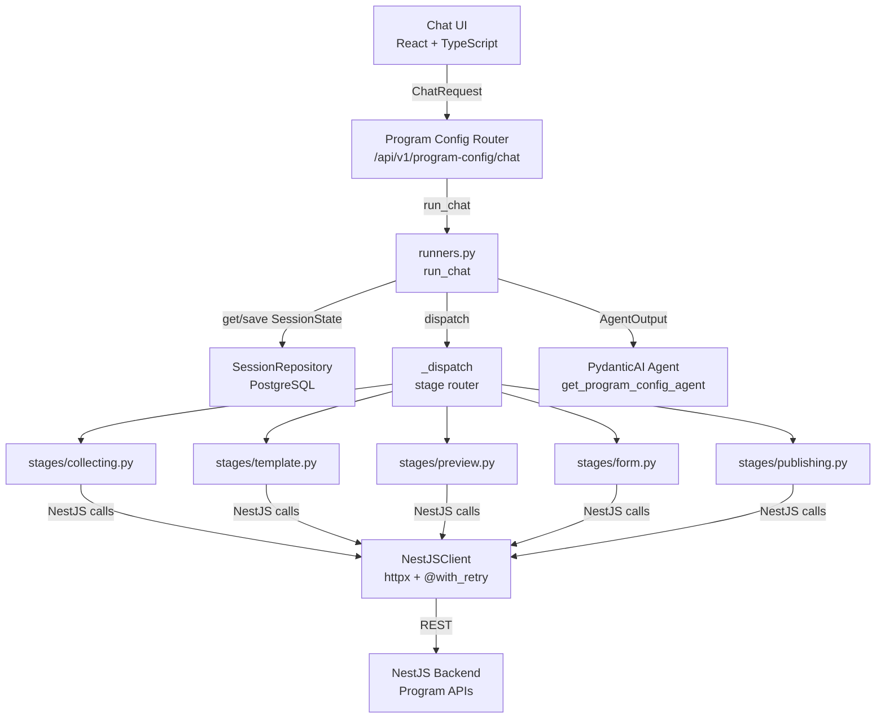
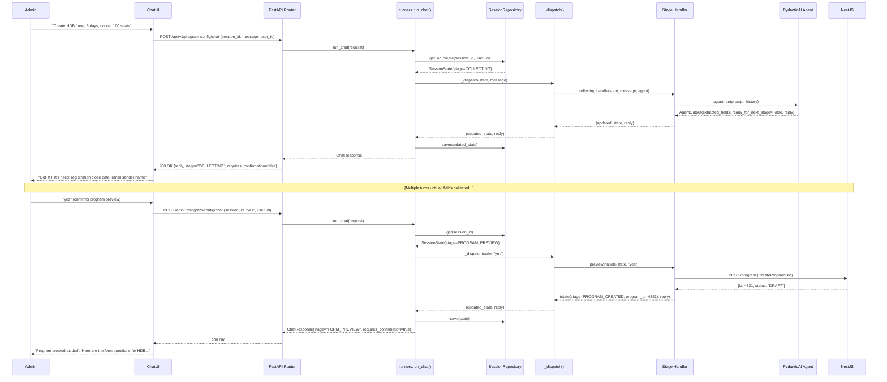

# PROGRAM-CONFIG TRD

The PROGRAM-CONFIG TRD specifies the technical design for the conversational program configuration agent. It implements the user stories in the PROGRAM-CONFIG PRD and targets the FastAPI + PydanticAI stack defined in the project CLAUDE.md. This document is the binding contract for implementation: every component, interface, state transition, and schema defined here governs what gets built in stage 50. Audience: backend engineers, the PTL (Madhuri Karedla), and any architect reviewing the integration design.

> **Note — merged stage**: This TRD is co-authored with the PRD as a merged stage (40a+40c). The PRD defines what; this TRD defines how. Both are approved together at the same gate.

---

Where are the seams and the contracts, and what events cross them?

<details><summary>Graph: Where are the seams and the contracts, and what events cross them?</summary>

```items
---
id: trd-cognition
title: PROGRAM-CONFIG TRD cognition
default_open_depth: 1
default_color_by: kind
color_palette_source: .daksh/color-palette.json
width: 95vw
---

Backend Components:
  - component-01 :: Program Config Agent | kind: Component | boundary: In scope — conversational configuration, NestJS API integration, session state machine. Out of scope — seeker registration flow, direct database writes, payment handling. | summary: FastAPI + PydanticAI backend service that conducts the admin configuration conversation and calls NestJS APIs to create and publish programs | spec: [§Architecture Overview](trd.md#architecture-overview)
  - component-07 :: Agent Stage Dispatcher | kind: Component | boundary: In — SessionState with current stage. Out — calls one of the five stage handlers, returns updated SessionState and reply text. | summary: Routes incoming session state to the correct stage handler (collecting, template, preview, form, publishing) | spec: [§Architecture Overview](trd.md#architecture-overview)
  - component-08 :: NestJS API Client | kind: Component | boundary: In — typed call params. Out — typed responses or mapped AppError. | summary: Thin async HTTP client wrapping all NestJS backend calls with retry and error mapping | spec: [§Architecture Overview](trd.md#architecture-overview)
  - component-09 :: Session Repository | kind: Component | boundary: In — session_id + user_id. Out — persisted SessionState. | summary: Reads and writes SessionState to PostgreSQL via SQLAlchemy async | spec: [§Architecture Overview](trd.md#architecture-overview)

Interfaces:
  - interface-01 :: Chat HTTP Interface | kind: Interface | summary: REST API between the React chat UI and the FastAPI backend | shape: [§Chat API Schema](trd.md#api-contracts) | version: 1.0.0 | compatibility: additive | spec: [§API Contracts](trd.md#api-contracts)
  - interface-02 :: NestJS Program API | kind: Interface | summary: External REST contracts to the NestJS backend for program CRUD and publish | shape: [§NestJS Contracts](trd.md#api-contracts) | version: pinned to current NestJS (treated as v1.0.0) | compatibility: breaking (any NestJS change breaks the agent) | spec: [§API Contracts](trd.md#api-contracts)
  - interface-03 :: Session Persistence Interface | kind: Interface | summary: SQLAlchemy async session contract for reading and writing agent session state | shape: [§Data Model](trd.md#data-model) | version: 1.0.0 | compatibility: additive | spec: [§Data Model](trd.md#data-model)
  - interface-04 :: Program Template API | kind: Interface | summary: NestJS read-only endpoint for fetching question templates by program type | shape: [§NestJS Contracts](trd.md#api-contracts) | version: 1.0.0 | compatibility: additive | spec: [§API Contracts](trd.md#api-contracts)

Events:
  - event-01 :: ProgramCreated | kind: Event | summary: Emitted after POST /program succeeds; carries programId and transition to PROGRAM_CREATED | payload_shape: { programId: int, programType: str, sessionId: str } | spec: [§Data Flow](trd.md#data-flow)
  - event-02 :: FormAttached | kind: Event | summary: Emitted after POST /program-question succeeds; carries questionCount | payload_shape: { programId: int, questionCount: int, sessionId: str } | spec: [§Data Flow](trd.md#data-flow)
  - event-03 :: ProgramPublished | kind: Event | summary: Emitted after PUT /program/:id/status succeeds; carries final accessType | payload_shape: { programId: int, accessType: str, sessionId: str } | spec: [§Data Flow](trd.md#data-flow)

Decisions:
  - dec-05 :: PydanticAI with typed output over bare LLM API | kind: Decision | summary: Use PydanticAI Agent with explicit output_type=AgentOutput (BaseModel) rather than calling the LLM API directly or using LangChain | alternatives: (1) Direct OpenAI/Gemini API with manual JSON parsing; (2) LangChain chains | reversal_trigger: PydanticAI structured output fails to parse field extraction reliably across > 5% of real admin messages | spec: [§Technology Choices](trd.md#technology-choices)
  - dec-06 :: Session state persisted in PostgreSQL, not in-memory | kind: Decision | summary: SessionState is persisted to PostgreSQL between requests rather than kept in server memory or Redis | alternatives: (1) In-memory dict with sticky sessions; (2) Redis session store | reversal_trigger: Session retrieval p99 exceeds 50ms under load, making in-memory or Redis preferable | spec: [§Technology Choices](trd.md#technology-choices)
  - dec-07 :: Stage handler per state-machine state | kind: Decision | summary: Each state machine stage (collecting, template, preview, form, publishing) is a separate Python module in stages/ rather than a monolithic dispatcher | alternatives: (1) Single large if/elif dispatcher in runners.py; (2) Strategy pattern with dynamic module loading | reversal_trigger: Stage handlers accumulate cross-state logic that makes the monolith cleaner | spec: [§Architecture Overview](trd.md#architecture-overview)
  - dec-08 :: NestJS API client with @with_retry decorator | kind: Decision | summary: All NestJS calls go through a shared NestJSClient with the @with_retry decorator rather than per-call httpx.get/post | alternatives: (1) Raw httpx calls per stage handler; (2) Separate service classes per NestJS resource | reversal_trigger: NestJS becomes reliable enough that retry overhead affects performance | spec: [§Technology Choices](trd.md#technology-choices)
  - dec-09 :: Use logfire spans for all external calls | kind: Decision | summary: Every NestJS API call and every agent run is wrapped in logfire.span() for observability rather than using print/logging | alternatives: (1) Stdlib logging; (2) No instrumentation in MVP | reversal_trigger: logfire costs exceed budget or operator overhead for span aggregation is not justified at this scale | spec: [§Technology Choices](trd.md#technology-choices)

Risks:
  - risk-03 :: LLM field extraction failure | kind: Risk | likelihood: medium | impact: medium | mitigation: AgentOutput uses strict Pydantic validation; failed extractions re-prompt the admin rather than silently dropping fields | phase: runtime | summary: The LLM may fail to extract a field correctly from complex or ambiguous admin messages, leading to incorrect CreateProgramDto assembly | spec: [§NFR Design](trd.md#nfr-design)
  - risk-04 :: NestJS API timeout under load | kind: Risk | likelihood: low | impact: high | mitigation: @with_retry decorator with 3 retries and exponential backoff; httpx timeout set to 10s per call | phase: runtime | summary: NestJS backend may time out during peak usage, leaving the agent session in a partial state | spec: [§NFR Design](trd.md#nfr-design)
  - risk-05 :: Duplicate program creation on retry | kind: Risk | likelihood: low | impact: high | mitigation: Check for existing DRAFT program for this session_id before calling POST /program; de-duplicate using session_id as idempotency key | phase: runtime | summary: If admin retries after a network timeout, the agent might call POST /program twice, creating duplicate program records | spec: [§Idempotency and Failure Contracts](trd.md#idempotency-and-failure-contracts)

Invariants:
  - invariant-01 :: Session state is always persisted before reply is sent | kind: Invariant | summary: The agent never returns a ChatResponse until the updated SessionState has been committed to the database | violation_signal: Agent returns 200 OK but the database shows the prior session state | spec: [§Persistence Constraints](trd.md#persistence-constraints)
  - invariant-02 :: accessType is always uppercase when sent to NestJS publish endpoint | kind: Invariant | summary: The string value of accessType in the PUT /program/:id/status payload is always one of PUBLIC, INTERNAL, or RESTRICTED in uppercase | violation_signal: NestJS returns 400 on the publish call | spec: [§API Contracts](trd.md#api-contracts)
  - invariant-03 :: Publish is blocked until form has at least 1 question | kind: Invariant | summary: The agent never calls PUT /program/:id/status unless the current session has form_attached=True and question_count >= 1 | violation_signal: Program published with no questions attached | spec: [§State Machines](trd.md#state-machines)
  - invariant-04 :: Agent output type is always a Pydantic BaseModel subclass | kind: Invariant | summary: PydanticAI Agent is initialized with explicit output_type=AgentOutput and the LLM is never called without a typed contract | violation_signal: Agent returns raw str or dict rather than AgentOutput | spec: [§Technology Choices](trd.md#technology-choices)

Open Questions:
  - oq-05 :: How to handle partial session recovery when NestJS call fails mid-state-transition? | kind: OpenQuestion | summary: If POST /program succeeds but the session DB write fails, how does the agent detect the orphaned program on retry and avoid creating a duplicate? | spec: [§Open Questions](trd.md#open-questions)
  - oq-06 :: Should sessions expire? | kind: OpenQuestion | summary: Whether a session started today can be resumed tomorrow, or if sessions expire after the conversation ends — and what the admin sees on resumption after expiry | spec: [§Open Questions](trd.md#open-questions)
  - oq-07 :: What happens if the program type has no registered template? | kind: OpenQuestion | summary: How the agent handles a program type with no question templates in the NestJS program type registry — present an empty form, block form attachment, or prompt for manual question entry | spec: [§Open Questions](trd.md#open-questions)

- sm-01 :: Program Config State Machine | kind: StateMachine | entity: Program Configuration Session | states: COLLECTING, TEMPLATE_SELECTION, PROGRAM_PREVIEW, PROGRAM_CREATED, FORM_PREVIEW, FORM_ATTACHED, READY_TO_PUBLISH, PUBLISHED | initial_state: COLLECTING | terminal_states: PUBLISHED | transitions: [§State Machines](trd.md#state-machines) | invariants_per_state: [§State Machines](trd.md#state-machines) | summary: Closed lifecycle of a single admin configuration session from first message to published program status | spec: [§State Machines](trd.md#state-machines)
- component-10 :: Program Config FastAPI Router | kind: Component | boundary: In — ChatRequest. Out — ChatResponse. | summary: Versioned REST endpoint at /api/v1/program-config/chat that accepts ChatRequest and returns ChatResponse | spec: [§API Contracts](trd.md#api-contracts)
- user-03 :: Madhuri Karedla / PTL | kind: User | role: PTL | audience: delivery | status: validated | summary: Project Technical Lead accountable for agent implementation and NestJS integration | spec: [§User Types](client-context.md#user-types)
- milestone-01 :: PROGRAM-CONFIG shipped | kind: Milestone | due: end of sprint | definition_of_done: All user stories AC-PC-001 through AC-PC-009 pass in staging; at least one real admin pilot session completed successfully | summary: Admin can configure and publish any HDB, MSD, TAT, or custom program via chat, and seekers see pre-filled registration forms | spec: [§Acceptance Criteria](prd.md#acceptance-criteria)

user-03 -> component-01 | relation: owns
component-01 -> component-07 | relation: decomposes_into
component-01 -> component-09 | relation: decomposes_into
component-07 -> interface-03 | relation: produces
component-08 -> interface-02 | relation: produces
component-08 -> interface-04 | relation: produces
component-10 -> interface-01 | relation: produces
interface-01 -> component-01 | relation: enables
interface-02 -> component-08 | relation: enables
interface-03 -> component-09 | relation: enables
component-01 -> sm-01 | relation: decomposes_into
component-01 -> event-01 | relation: produces
component-01 -> event-02 | relation: produces
component-01 -> event-03 | relation: produces
risk-03 -> component-01 | relation: threatens
risk-04 -> component-08 | relation: threatens
risk-05 -> component-09 | relation: threatens
oq-05 -> sm-01 | relation: threatens
oq-06 -> component-09 | relation: threatens
oq-07 -> component-07 | relation: threatens
invariant-01 -> component-09 | relation: watches
invariant-02 -> interface-02 | relation: watches
invariant-03 -> sm-01 | relation: watches
invariant-04 -> component-01 | relation: watches
dec-05 -> component-01 | relation: governs
dec-06 -> component-09 | relation: governs
dec-07 -> component-07 | relation: governs
dec-08 -> component-08 | relation: governs
dec-09 -> component-08 | relation: governs
milestone-01 -> component-01 | relation: serves
```

</details>

---

## Architecture Overview

The Program Config Agent is a PydanticAI singleton (`Agent[None, AgentOutput]`) that sits behind a single FastAPI endpoint. Every request carries a `session_id` and a `message`. The request lifecycle is:

1. **FastAPI route** (`component-10`) receives `ChatRequest`, validates the JWT, extracts `user_id`, and calls `run_chat()`.
2. **`run_chat()` in runners.py** loads or creates the `SessionState` from the `SessionRepository` (`component-09`). It appends the new message to `message_history` and calls `_dispatch()`.
3. **`_dispatch()` in runners.py** (`component-07`) reads `session.stage` and routes to the appropriate stage handler module under `stages/`.
4. **Stage handler** (one of `collecting.py`, `template.py`, `preview.py`, `form.py`, `publishing.py`) executes the stage logic. Stages that need LLM reasoning call `agent.run(prompt, message_history=history)` on the PydanticAI singleton. Stages that need NestJS data call `NestJSClient` (`component-08`) methods.
5. The stage handler returns `(updated_state, reply_text)` to `_dispatch()`, which returns it to `run_chat()`.
6. **`run_chat()`** calls `session_repository.save(updated_state)` — state is always persisted **before** the response is assembled. This is `invariant-01`.
7. `run_chat()` assembles and returns `ChatResponse`. The FastAPI route wraps it in `APIResponse[ChatResponse]` and returns HTTP 200.

The stage-handler pattern (dec-07) means each state machine stage is an independently readable and testable unit. Adding a new stage is a matter of adding a new module to `stages/` and a new branch in `_dispatch()`.

---

## Component Diagram



---

## Data Model

### AgentSession — PostgreSQL table

```sql
CREATE TABLE agent_sessions (
    id          UUID PRIMARY KEY DEFAULT gen_random_uuid(),
    session_id  VARCHAR(128) NOT NULL UNIQUE,
    user_id     INTEGER NOT NULL,
    stage       VARCHAR(64) NOT NULL DEFAULT 'COLLECTING',
    state_data  JSONB NOT NULL DEFAULT '{}',
    program_id  INTEGER,
    created_at  TIMESTAMPTZ NOT NULL DEFAULT now(),
    updated_at  TIMESTAMPTZ NOT NULL DEFAULT now(),
    deleted_at  TIMESTAMPTZ
);

CREATE INDEX idx_agent_sessions_session_id ON agent_sessions(session_id);
CREATE INDEX idx_agent_sessions_user_id    ON agent_sessions(user_id);
```

Notes:
- `id` is a UUID surrogate primary key — not `session_id`. This allows future session merging without breaking the unique constraint.
- `session_id` has a UNIQUE constraint. A duplicate `session_id` from the client returns 409; the client must reuse the same `session_id` for the same conversation.
- `state_data` is a JSONB column that holds the full serialized `SessionState` model (see below). No foreign key constraints are placed on nested program fields — they are transient until `PROGRAM_CREATED`.
- `program_id` is nullable. It is null until the admin confirms the program preview and POST /program returns a `programId`.
- `deleted_at` supports soft delete. Sessions older than 30 days are soft-deleted by a background job (not part of this sprint).
- Migration policy: additive-only during v1. Column type changes use expand/contract.

### SessionState — Pydantic model (serialized into state_data JSONB)

```python
class SessionState(BaseModel):
    stage: ProgramConfigStage = ProgramConfigStage.COLLECTING
    program_config: CreateProgramDto = Field(default_factory=CreateProgramDto)
    program_id: int | None = None
    template_id: int | None = None
    pending_questions: list[QuestionDto] = Field(default_factory=list)
    question_count: int = 0
    form_attached: bool = False
    message_history: list[MessageHistoryItem] = Field(default_factory=list)
```

### AgentOutput — what PydanticAI LLM returns

```python
class AgentOutput(BaseModel):
    reply: str
    extracted_fields: dict[str, Any] = Field(default_factory=dict)
    ready_for_next_stage: bool = False
    requires_confirmation: bool = False
    preview_data: dict[str, Any] | None = None
```

`AgentOutput` is the typed contract between the LLM and the Python orchestrator. PydanticAI validates the LLM's JSON output against this model before returning it to the stage handler. If validation fails, PydanticAI raises `UnexpectedModelBehavior`; the runner catches it, logs it, and returns a user-facing error rather than surfacing a stack trace.

### ProgramConfigStage — enum

```python
class ProgramConfigStage(str, Enum):
    COLLECTING         = "COLLECTING"
    TEMPLATE_SELECTION = "TEMPLATE_SELECTION"
    PROGRAM_PREVIEW    = "PROGRAM_PREVIEW"
    PROGRAM_CREATED    = "PROGRAM_CREATED"
    FORM_PREVIEW       = "FORM_PREVIEW"
    FORM_ATTACHED      = "FORM_ATTACHED"
    READY_TO_PUBLISH   = "READY_TO_PUBLISH"
    PUBLISHED          = "PUBLISHED"
```

---

## Persistence Constraints

- `session_id` is generated client-side (UUID4) and sent on every `ChatRequest`. The server never generates session IDs.
- Session creation is idempotent via the UNIQUE constraint on `session_id`. A second `POST /chat` with the same `session_id` simply loads the existing session — it does not create a second row.
- `state_data` JSONB: no foreign key constraints on nested program fields. Fields inside `program_config` reference NestJS entities (e.g., `typeId`) by integer ID, but those IDs are not enforced at the PostgreSQL level. Integrity is enforced when the NestJS API rejects an invalid payload.
- Session state is **always saved before the HTTP response is returned** (invariant-01). The runner calls `repository.save()` inside a `try/except`; if the save fails, the runner returns an HTTP 500 rather than an inconsistent 200.
- Retention: a background job soft-deletes sessions (`deleted_at = now()`) older than 30 days. Soft-deleted sessions are excluded from all repository queries via a default filter.
- Indexes: `session_id` (unique lookup by client-generated ID) and `user_id` (user history queries and session isolation).

---

## State Machines

### Program Config State Machine (sm-01)

States: `COLLECTING → TEMPLATE_SELECTION → PROGRAM_PREVIEW → PROGRAM_CREATED → FORM_PREVIEW → FORM_ATTACHED → READY_TO_PUBLISH → PUBLISHED`

#### Transition Table

| From | To | Trigger | Guard | Side Effects |
|------|----|---------|----|---|
| COLLECTING | TEMPLATE_SELECTION | All required fields extracted and confirmed | All required `CreateProgramDto` fields are non-null | None |
| TEMPLATE_SELECTION | PROGRAM_PREVIEW | Admin confirms template selection | `template_id` is set in session | Assemble full preview dict |
| PROGRAM_PREVIEW | COLLECTING | Admin says "edit [field]" | None | Clear only the specified field from `program_config` |
| PROGRAM_PREVIEW | PROGRAM_CREATED | Admin confirms preview | All required fields still valid; program code unique | POST /program → set `program_id` |
| PROGRAM_CREATED | FORM_PREVIEW | Auto-transition after PROGRAM_CREATED | `program_id` is set | Load template questions for program type |
| FORM_PREVIEW | FORM_ATTACHED | Admin confirms form questions | At least 1 question in `pending_questions` | POST /program-question; set `form_attached=True`, `question_count` |
| FORM_PREVIEW | FORM_PREVIEW | Admin edits questions (add/remove/reorder) | None | Update `pending_questions`, re-show preview |
| FORM_ATTACHED | READY_TO_PUBLISH | Admin says "publish" | `form_attached=True`, `question_count >= 1` | Run `validate_for_publish()` |
| READY_TO_PUBLISH | PUBLISHED | Admin confirms | All validation checks pass | PUT /program/:id/status with uppercase `accessType` |
| READY_TO_PUBLISH | FORM_PREVIEW | Validation fails: no form | `form_attached=False` or `question_count=0` | Prompt admin to attach form |

#### Invariants per state

| State | Invariants |
|-------|-----------|
| COLLECTING | `program_id` is None; `form_attached` is False |
| PROGRAM_CREATED | `program_id` is not None; stage cannot regress past PROGRAM_PREVIEW without starting a new session |
| FORM_ATTACHED | `question_count >= 1`; `program_id` is not None |
| PUBLISHED | `form_attached=True`; `question_count >= 1`; `program_id` is not None |

#### Failure recovery

If any NestJS call fails during a state transition, **the stage does NOT advance**. The session state remains in the pre-transition stage. The runner logs the error with `logfire.exception()`, returns a descriptive error message to the admin, and the admin can retry on the next message. Because the stage did not advance, no data is lost and no partial state is committed.

---

## API Contracts

### Chat API (exposed by FastAPI)

```
POST /api/v1/program-config/chat
Content-Type: application/json
Authorization: Bearer <jwt>

Request body:
{
  "session_id": "string (UUID4, client-generated)",
  "message":    "string (admin's chat message)",
  "user_id":    integer
}

Response 200:
{
  "success": true,
  "data": {
    "session_id":            "string",
    "reply":                 "string (agent's response text)",
    "stage":                 "COLLECTING | TEMPLATE_SELECTION | PROGRAM_PREVIEW | PROGRAM_CREATED | FORM_PREVIEW | FORM_ATTACHED | READY_TO_PUBLISH | PUBLISHED",
    "requires_confirmation": boolean,
    "preview_data":          object | null
  }
}

Response 4xx / 5xx:
{
  "success": false,
  "error": {
    "code":    "string",
    "message": "string"
  }
}
```

Version: 1.0.0. Compatibility: additive — new fields may be added to the response without a version bump; removing or renaming fields requires a version bump.

### NestJS APIs consumed

| Method | Path | Payload / Query | Response |
|--------|------|-----------------|----------|
| POST | `/program` | `CreateProgramDto` (camelCase) | `{ id: int, code: str, status: "DRAFT" }` |
| POST | `/program-question` | `{ programId: int, questions: QuestionDto[] }` | `{ count: int }` |
| POST | `/program/clone-from-template` | `{ programId: int, programTemplateId: int }` | `{ id: int }` |
| PUT | `/program/:id/status` | `{ status: "PUBLISHED", updatedBy: int, accessType: "PUBLIC"\|"INTERNAL"\|"RESTRICTED" }` | `{ id: int, status: "PUBLISHED" }` |
| GET | `/v1/program-templates/program-type/:typeId` | — | `{ templates: TemplateDto[] }` |
| GET | `/program/check-code` | `?code=:code&excludeId=:id` | `{ available: bool }` |

**Critical**: `accessType` in the PUT payload must be uppercase (`PUBLIC`, `INTERNAL`, `RESTRICTED`). Lowercase values cause a 400 response from NestJS. This was a production bug; `invariant-02` enforces the fix.

---

## Idempotency and Failure Contracts

**Session creation**: Idempotent via `session_id` UNIQUE constraint. A second request with the same `session_id` loads the existing session (no new row created, no 500). Clients must generate session IDs client-side and reuse them across retries.

**POST /program (program creation)**: Guarded by checking `session.stage == PROGRAM_PREVIEW` before calling. Once `PROGRAM_CREATED`, any retry of the same message hits the already-created stage and does not re-call POST /program. Cross-session deduplication: `session_id` is stored with the program; a second session with a different `session_id` would create a second program (expected — different admin intent).

**PUT /program/:id/status (publish)**: NestJS is responsible for idempotency of publish — re-publishing an already-PUBLISHED program is a no-op on the NestJS side. The agent double-checks `session.stage != PUBLISHED` before calling.

**Retry semantics**: `@with_retry(max_retries=3, backoff_factor=2)` on all NestJS calls; `httpx` timeout set to 10s per call.

**Terminal 4xx errors**: If NestJS returns a 4xx that is not 429 (rate limit) or a transient error, the agent does NOT retry. It surfaces the error to the admin as a clear, human-readable message (e.g., "The program code 'HDB-JUN-25' is already taken — please suggest a different code.").

**At-least-once guard for POST /program**: Before calling POST /program, the runner checks `session.program_id is None`. If `program_id` is already set, the call is skipped. This prevents duplicate programs if the NestJS call succeeds but the session write fails and the admin retries.

---

## Data Flow



---

## Technology Choices

This module conforms to the **Technology Baseline** defined in `CLAUDE.md`: Python 3.11+, FastAPI, PostgreSQL 14+, uv, PydanticAI, SQLAlchemy async, logfire.

Module-discretionary choices (decisions specific to this module):

**dec-05 — PydanticAI with typed output**: `Agent[None, AgentOutput]` is instantiated once as a module-level singleton in `agent.py`. The `output_type=AgentOutput` constraint forces the LLM to return structured JSON. This eliminates the need for manual JSON parsing and gives us Pydantic validation on every LLM response. The alternative (direct API calls with manual parsing) was rejected because it duplicates what PydanticAI already provides and introduces a parsing failure mode we would have to handle ourselves.

**dec-06 — PostgreSQL for session state**: SessionState is persisted to PostgreSQL (the same database the rest of the platform uses) rather than Redis or in-memory storage. This simplifies the operational footprint — no additional service to run or monitor. The tradeoff is that every request incurs a database read and write. At Infinitheism's scale (10–50 concurrent admin sessions), this is well within PostgreSQL's capacity. Redis would be reconsidered if session retrieval p99 exceeds 50ms.

**dec-07 — Stage handler per state-machine state**: Five stage handler modules (`stages/collecting.py`, `stages/template.py`, `stages/preview.py`, `stages/form.py`, `stages/publishing.py`) correspond one-to-one with the state machine's logical stages. The dispatcher in `runners.py` is a single `match session.stage` block. This makes each stage independently testable and prevents the "god runner" anti-pattern. A monolith dispatcher was considered but rejected because the state machine has 8 states with meaningfully different logic in each.

**dec-08 — Shared NestJS client with @with_retry**: All NestJS calls go through `NestJSClient` in `packages/client/nestjs_client.py`. This client holds a shared `httpx.AsyncClient` instance (connection pooling) and applies `@with_retry` uniformly. Per-call httpx usage was rejected because it creates a new connection for every call and duplicates retry logic across stage handlers.

**dec-09 — logfire spans for all external calls**: Every agent run and every NestJS call is wrapped in `logfire.span()`. This is a project-wide standard (per `CLAUDE.md`), not a module choice. The module decision is the span field set: every span includes `session_id`, `user_id`, and the current `stage`. This makes distributed traces filterable by session, making debugging admin configuration failures straightforward.

No additional module-local libraries are required. `httpx` is already in the project; no new dependencies are introduced by this module.

---

## Security

**Authentication**: JWT token validation is handled by FastAPI middleware before the request reaches the `program_config` router. The `user_id` is extracted from the validated JWT and injected into the request context. The `user_id` field in `ChatRequest` is ignored — it is there only for client convenience and logging; the server never trusts it for authorization.

**Authorization**: Sessions are user-scoped. Every `SessionRepository` query includes `WHERE session_id = :sid AND user_id = :uid`. A request presenting a valid JWT for user A with a `session_id` that belongs to user B returns 403. This is tested explicitly in the security test suite (TASK-PC-024).

**Data protection**: `SessionState` (stored as JSONB) may contain fee amounts, GST details, and program pricing. In MVP, this data is stored unencrypted at rest — flagged for compliance review before any production deployment to a regulated environment.

**Audit trail**: Every NestJS call is wrapped in `logfire.span()` with `session_id` and `user_id`. The `ProgramPublished` event (event-03) carries the `accessType` and `programId` and is logged at INFO level for audit purposes.

---

## NFR Design

**Response latency targets:**
- COLLECTING stage (LLM call + DB read/write): p95 < 3s
- Stages that make NestJS calls (PROGRAM_PREVIEW confirm, FORM_ATTACHED confirm, PUBLISHED): p95 < 5s
- All other stages (no LLM, no NestJS): p95 < 500ms

**Concurrent sessions**: Designed for 10–50 concurrent admin sessions. Infinitheism is a small organization; this scale does not require horizontal scaling in MVP. A single Uvicorn process with async I/O is sufficient.

**LLM failure handling**: If `agent.run()` raises `UnexpectedModelBehavior`, the runner re-prompts once with a simplified prompt. If the second attempt also fails, the runner returns an HTTP 502 with a user-facing message: "I had trouble understanding that — could you rephrase?". The session state is not advanced; the admin can retry.

**NestJS timeout handling**: `@with_retry(max_retries=3, backoff_factor=2)` covers transient timeouts. If all retries are exhausted, the runner returns HTTP 502 with a message explaining the downstream service is unavailable. The session stage does not advance (failure recovery invariant).

**Database availability**: If `SessionRepository.get_or_create()` fails (database unavailable), the request returns HTTP 503. No session state is created. The admin must retry when the database is available.

---

## Deployment and Operations

> Note: No `docs/operations-map.md` exists for this project yet — this section documents intent only.

**Target environment**: Same server as the existing FastAPI backend. No new infrastructure required.

**Runtime**: uv-managed Python 3.11+, single Uvicorn process (not Gunicorn in MVP). Gunicorn with multiple workers would be considered if concurrent session count exceeds 100.

**Config surface** (all from `.env`):
- `DATABASE_URL` — PostgreSQL connection string
- `GOOGLE_API_KEY` or `GROQ_API_KEY` — LLM provider key (via `get_model()` in `model_factory.py`)
- `NESTJS_BASE_URL` — Base URL for the NestJS backend
- `JWT_SECRET_KEY` — Used by middleware to validate JWT tokens

**Observability**: logfire spans for every agent run (span name: `program_config.chat`), every NestJS call (span name: `nestjs.<method>.<path>`), and every session save (span name: `session.save`). Span fields: `session_id`, `user_id`, `stage`, `program_id` (when set).

**Rollback**: Stateless compute — rolling back means redeploying the prior container image. Database migrations are additive-only for v1, so no schema rollback is needed. If a migration must be rolled back, the expand/contract pattern is used.

---

## Testing Strategy

### Test types in scope

| Type | Scope | Target |
|------|-------|--------|
| Unit | In scope | Stage handlers, `rules.py`, `api_client.py` (mocked NestJS), `SessionRepository` (test DB) |
| Integration | In scope | Full `run_chat()` against real test DB and mocked NestJS (respx), all 8 state transitions |
| End-to-end | In scope | One happy path COLLECTING → PUBLISHED against staging NestJS |
| Security | In scope | JWT enforcement; session isolation (user A cannot access user B's session) |
| Contract | In scope | POST /api/v1/program-config/chat response matches OpenAPI schema |
| Performance / load | Out of scope | Revisit post-launch |
| Accessibility | Out of scope | Backend API; UI accessibility is a frontend concern |
| Chaos / resilience | Out of scope for sprint 1 | Add NestJS timeout simulation in sprint 2 |
| Exploratory / manual | In scope | At least one full admin pilot session on staging before production deploy |
| UAT | In scope | One admin pilot session counts as UAT for this sprint |

### Coverage targets

- Unit: ≥80% line coverage for stage handlers and `rules.py`; 100% for `api_client.py` call paths
- Integration: all 8 state transitions covered; happy path + at least one failure path per NestJS call (timeout, 400, 500)
- E2E: 1 happy-path run per release from COLLECTING to PUBLISHED

### Risk-based focus (heaviest investment)

1. **PROGRAM_CREATED transition**: POST /program failing must not advance the stage. This is the highest-risk irreversible side effect — a duplicate program in the database is hard to clean up and confusing for admins.
2. **PUBLISHED transition**: `accessType` uppercase enforcement (prior production bug). PUT /program/:id/status must be idempotent.
3. **Session isolation**: User A's session must never be readable by user B. Verified in TASK-PC-024.

### Test data strategy

- Unit tests: Pydantic model factories in `tests/factories/`; each test creates its own `SessionState` instance with the fields it needs.
- Integration tests: Test PostgreSQL database (separate schema from dev); reset between test runs via transactional teardown (each test runs in a transaction that is rolled back after the test).
- Shared fixtures: `get_test_session(stage=ProgramConfigStage.X)` factory that returns a `SessionState` at any stage.

### Mock boundaries

| System | Unit / Integration | E2E |
|--------|-------------------|-----|
| NestJS backend | Mocked with `respx` (httpx-compatible mock) | Real NestJS staging instance |
| PydanticAI LLM | Mocked (return a fixed `AgentOutput`) | Real LLM |
| PostgreSQL | Real test database (not mocked) | Real staging database |

The rule "integration tests must hit a real database" is per `CLAUDE.md`.

### Regression posture

- Unit + integration: run on every PR (triggered by push to any branch)
- E2E: run nightly on the main branch against staging
- Contract test: run on every PR that touches the API route or schemas

---

## Open Questions

| # | Question | Blocks | Status |
|---|---|---|---|
| OQ-05 | If POST /program succeeds but the session DB write fails, how does the agent detect the orphaned program on retry and avoid creating a duplicate? | sm-01 failure recovery design | Open |
| OQ-06 | Should sessions expire? If so, what is the TTL and what does the admin see on resumption after expiry? | component-09 retention policy | Open |
| OQ-07 | What happens when the admin configures a program type with no registered template in the NestJS program type registry? | component-07 template stage logic | Open |

---

## Approval

*Weight class: small — 1 approval required per gate. PRD and TRD approved together (merged stage 40a+40c).*

Approved by:
Role:
Date:
